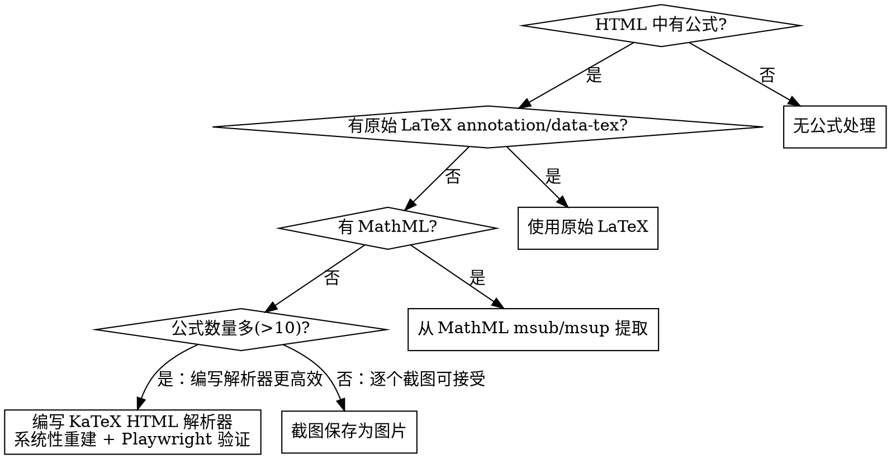
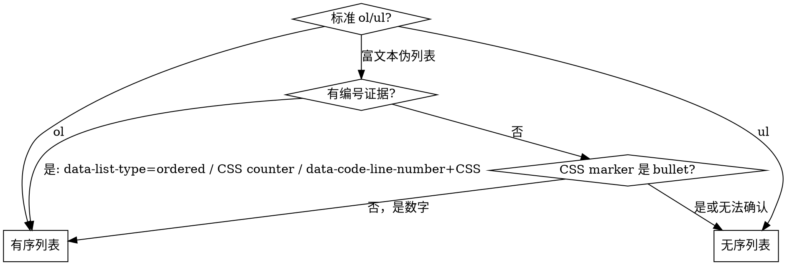

# SingleFile HTML 转离线 Markdown 包

将 SingleFile 保存的网页 HTML 转换为干净、结构清晰、可离线阅读的 Markdown 文档包。

**适用范围：** 仅处理 [SingleFile](https://github.com/niclab/singlefile) 浏览器扩展保存的 `.html` 文件。SingleFile 将整个页面（含 CSS、图片 base64、字体）打包为单个 HTML 文件。

## 核心原则

**不要一次性机械转写 HTML。** 采用迭代流程：

```text
初始转换 → 自动结构检查 → 浏览器渲染对比 → 整页截图核对 → 高风险区域局部截图复核 → 定位差异 → 局部修复 → 再次核对 → 输出
```

**公式能渲染 ≠ 公式语义正确。** `\pi\theta(a|s)` 能渲染但不是 `\pi_\theta(a|s)`。

## 输出结构

最终只输出一个 `.zip` 压缩包，内含：

```text
<zip-英文名>.zip
└── 文章标题目录/
    ├── 文章标题.md
    └── files/
        └── <zip-英文名>/
            ├── image_01.png
            └── comment_image_01.png
```

ZIP 文件名：英文/数字/下划线/短横线，保留原始数字序号，不用中文。

## 同源批量处理

当多个 HTML 文件来自同一站点时（如极客时间课程系列、掘金专栏等），DOM 结构完全一致。应采用脚本化批量处理而非逐篇手动转换：

1. **先分析一篇**：用 Playwright 检查 DOM 结构，确定正文容器、编辑器类型、评论区选择器、元信息提取方式
2. **编写 Python 脚本**：基于 BeautifulSoup 实现通用转换逻辑，处理所有同源文件
3. **内置审计计数**：脚本中集成 DOM 基线 vs Markdown 输出的自动计数对比
4. **统一打包**：所有文章输出到一个 zip 中，每篇文章一个子目录

脚本化的优势：一次调试解决所有文件的结构问题，避免逐篇重复踩同样的坑。

## BeautifulSoup 解析器选择

**必须使用 `lxml` 解析器**，不得使用 `html.parser`。原因：SingleFile 保存的 HTML 经常包含未闭合的 `<th>`/`<td>` 标签（如 `<th>A<th>B<th>C`），`html.parser` 会将其嵌套处理（导致表头内容级联合并：第一个 th 包含所有后续 th 的文本），而 `lxml` 能正确识别同级兄弟关系。这是 SingleFile 保存行为导致的普遍问题，不限于特定站点。

## 工作流

### 0. 复杂度分级（决定后续步骤的详略）

在 DOM 审计（§1.5）完成后，根据页面内容复杂度分级，决定后续验证步骤的详略：

| 级别 | 条件 | 公式相关步骤 | 截图验证 |
|------|------|-------------|---------|
| Level 0 | 无公式、无正文图片、无代码块、无评论（纯文本 + 表格 + 链接） | 全部跳过 | 整页对比即可 |
| Level 1 | 无公式（N_formula = 0） | 全部跳过 | 整页对比 + 列表/评论局部 |
| Level 2 | 有公式，有原始 LaTeX | 提取 + KaTeX 渲染验证 | 整页 + 公式区域局部 |
| Level 3 | 有公式，无原始 LaTeX，需重建 | 完整公式处理流程 | 整页 + 逐公式局部 |

**Level 0 极简路径**：页面仅包含文本段落、表格和链接时，无需图片解码、代码块语言检测、评论区筛选等步骤。验证只需整页截图对比 + 表格行列计数。适用于企业内部指引、政策说明等纯文字页面。

**Level 1 快速路径**：无公式时，§2 中公式处理、§3c 中 KaTeX 渲染验证、§3b 中公式相关检查项全部跳过。但列表/评论/图片/代码块的验证仍然是强制的。

### 1. 识别主体内容

SingleFile HTML 包含完整页面（导航栏、侧边栏、广告、评论区等），需要定位正文容器。

**SingleFile 特征：** 所有 CSS 内联、图片 base64 编码、字体嵌入——文件体积大但结构与原始 DOM 一致。用 Playwright 打开 SingleFile HTML 时，页面渲染效果与原网页相同。

**定位正文容器的策略：**
1. 先用 Playwright 检查 DOM，搜索语义容器（`<article>`, `<main>`, `[role="main"]`）或富文本编辑器标记（`[data-slate-editor]`）
2. 如果无法通过选择器确定，用 Playwright 截图对照 DOM 定位文本密度最高的区域

**选择器歧义防范：** 同一 CSS class pattern 可能在页面不同区域出现（如 `[class*="articleTitle"]` 同时匹配侧边栏目录标题和正文标题）。提取标题、作者等元信息时，**必须限定在正文容器内搜索**，不能全页 `querySelector`。先确定正文容器的唯一选择器，再在其内部提取子元素。

### 1.5. DOM 完整性审计（提取前必须执行）

在开始提取内容之前，必须先用 Playwright 对主体容器做一次完整的 DOM 审计，建立**原始计数基线**。先确定页面使用的标记模式（标准 HTML 标签 vs 富文本编辑器 `data-*` 属性），然后选用对应的选择器查询。

```text
审计项           | 查询方式（根据实际 DOM 结构选择）        | 记录值
-----------------|------------------------------------------|--------
块级公式         | .katex-display                           | N_formula_block
行内公式         | .katex（非 display 子代）                | N_formula_inline
列表容器         | ol/ul 或 [data-slate-type="list"] 等     | N_list
列表项           | li 或 [data-slate-type="list-line"] 等   | N_list_item
图片             | img（排除装饰图后）                      | N_image
代码块           | pre>code 或富文本代码容器                | N_codeblock
标题             | h1-h6                                    | N_heading
评论             | 评论区顶层容器内评论条目                 | N_comment
```

**列表项计数是强制的**——仅统计列表容器数量无法发现"多个列表项被合并成一段文字"的问题。

**容器嵌套穿透规则**：遍历主体容器的直接子节点时，如果某个子节点没有内容类型标记，**必须递归搜索其后代节点**中的内容块。任何不带语义标记的中间 div/section 都可能是纯布局容器。

### 1.6. 富文本编辑器适配（识别到非标准 HTML 时必须执行）

SingleFile 保存的页面可能使用富文本编辑器（如 Slate），**不使用标准 HTML 语义标签**（`<ul>/<ol>/<li>/<pre>/<code>` 等），而是通过 `data-*` 属性标记内容类型。

**检测方法**：用 Playwright 在主体容器中搜索 `[data-slate-type]`、`[data-slate-editor]` 等特征属性。有匹配则为富文本编辑器内容，需要先建立语义标记到标准 HTML 的映射，再开始提取。

**Slate 编辑器映射示例（极客时间等）：**

| 标准 HTML | Slate `data-slate-type` | 提取要点 |
|-----------|-------------------------|----------|
| `<p>` | `paragraph` | 普通段落 |
| `<h1>`-`<h6>` | `heading`（或直接用标准 `<h2>`/`<h3>` 标签） | 标题层级从 HTML 标签名获取，而非 slate-type |
| `<ul>/<ol>` | `list`（容器）| **必须检测**，否则列表项会被合并成纯文本段落。**注意：list 容器的直接子节点不仅有 list-line，还可能有 paragraph、block-katex、嵌套 list 等混合类型**——必须遍历所有直接子节点，而非仅 `find_all(list-line)` |
| `<li>` | `list-line`（列表项） | 每个 `list-line` 输出为一个 bullet/编号 |
| `<pre><code>` | `pre`（容器）+ `code-line`（子节点） | 用 `data-slate-type="pre"` 定位容器，子树中查找 `code-line` 逐行提取。注意：`data-origin="pm_code_preview"` 可能在更深的后代而非直接子节点上 |
| `<code>` | `code` | 行内代码 |
| `<strong>` | `bold` | 加粗 |
| `<em>` | `italic` | 斜体 |
| `<blockquote>` | `block-quote`（容器）+ `quote-line`（子节点） | 引用 |
| `<a>` | `link` | 链接 |
| `` | `image` | 图片块（内含 `` 标签） |
| 高亮/标记 | `mark-class` | 仅标记样式，递归处理子节点即可 |

**其他编辑器**：结构各异——先用 Playwright DOM inspector 确认标记模式，再建立映射。

**关键教训**：如果 converter 只处理标准 `<ul>/<ol>/<li>` 但源 HTML 使用 `data-slate-type="list"/"list-line"`，列表项会被静默合并成一段文字——**不会报错，不会丢失文字内容，只丢失列表结构**。必须依赖列表项计数对比才能捕获。

**块级公式的两种 DOM 模式**：同一站点的不同文章可能使用不同方式承载块级公式：
1. `data-slate-type="block-katex"` — 独立的 Slate 块节点，直接包含 `.katex-html`
2. **无 `data-slate-type` 的 wrapper div** — 内部深层嵌套 `.katex-display` 元素（可能嵌套 7+ 层）。此时必须对无类型 div 执行 `node.find(class_='katex-display')` 探测，发现后作为块级公式处理

仅处理模式 1 会导致模式 2 的块级公式被降级为行内公式或丢失 `$$` 分界符，引发级联配对错位。

**残留 `$$` 文本段落**：部分文章的块级公式（尤其模式 2）后面紧跟一个 paragraph 节点，其内容仅为字面字符串 `$$`（KaTeX 渲染前的残留标记）。必须在 paragraph 处理中过滤掉这类纯 `$$` 段落，否则 Markdown 中会出现多余的 `$$` 行，导致所有后续块级公式分界符错位——与空 block-katex 的 stray `$$` 效果完全相同。

### 2. 提取与转换

**公式处理（最高风险）：** 详见 @blocking-rules.md §0.2-§0.4

提取优先级：
1. `annotation[encoding="application/x-tex"]`
2. `data-tex` / `data-latex` / `data-math` / `alttext`
3. `<script type="math/tex">`
4. 页面 JSON / hydration 数据
5. MathML 结构（`msub`=下标, `msup`=上标, `msubsup`=同时）
6. **系统性 KaTeX HTML 重建**（见 §0.4.2）：当上述方式全部不可用时，可通过解析 `.katex-html` 渲染层 DOM 重建 LaTeX，但必须满足：编写可复用的解析器（非手动逐公式拼接）、覆盖 vlist/mop/mfrac/msupsub 等关键结构、通过 Playwright 渲染验证 0 error
7. 上述全部不可行 → 截图保存为图片

上下标方向必须忠实原文：不得把 `V_\pi` 改成 `V^\pi`，也不得反向。修复 Double subscript 只能补分组（`d_{\pi_\theta}`），不能改方向。

**列表处理：**

| 证据 | 输出 |
|------|------|
| `<ol>` / `data-list-type="ordered"` / CSS counter 数字 / `content: attr(data-code-line-number) "."` | 有序列表 |
| `<ul>` / CSS `content:"•"` / `"·"` / `"-"` / `"●"` | 无序列表 |
| 仅 `data-slate-type="list-line"` 无其他证据 | 无序列表 |
| 无法确认 | 无序列表 |

禁止双 marker（`-- item` / `- 1. item` / `1. - item`）。

**评论区处理：**

不得默认删除评论区。必须先识别评论区（`comment` / `reply` / `discussion` / `评论` / `回复` / `精选留言` 等线索），再区分有价值评论和噪声。

**关键：只匹配顶层评论容器**（如 `mainWrapper`、`comment-item` 等包含完整用户名+正文+时间的元素），不能用 `[class*="CommentItem"]` 这类宽泛选择器——它会命中用户名 div、正文 div、时间 span 等子元素，导致一条评论被拆成多条（碎片化）。

保留：技术问题、纠错、补充、实践经验、作者/讲师/官方回复、长评论、含代码/公式/链接评论。
删除：纯"打卡""学习了""666"、纯表情、广告、头像/点赞/UI控件。
无法判断 → 保留并标注"评论价值待人工复核"。

评论格式：每条评论用 `### 评论 N`，评论中代码/日志/报错必须 fenced code block。每条评论应包含用户名、正文、时间（如有）。作者回复紧跟在对应评论下方，**必须用 blockquote 格式（`>`）**使回复内容与评论正文在视觉上明确区分——用 `#### 回复` 标题不够明显，容易与评论正文混淆。

```markdown
### 评论 1
**用户名**（2025-10-16）

评论正文内容...

> **作者回复**
>
> 回复内容...
```

**块级居中：**

原网页居中的公式块/图片/图表/图注/署名 → Markdown 也必须居中：

```markdown
<div align="center">

$$
V_\pi(s)=\mathbb{E}_\pi\left[R_t+\gamma V_\pi(S_{t+1})\mid S_t=s\right]
$$

</div>
```

居中证据：`text-align:center` / `align="center"` / `display:flex; justify-content:center` / `margin:auto` / `.katex-display` / 截图。无证据不得擅自居中。块级公式不能降级成行内 `$...$`。

**图片与资源（SingleFile 特有）：**

SingleFile 将所有图片编码为 base64 `data:image/...` 内嵌在 HTML 中。必须解码为独立图片文件。

- 正文图片保存到 `files/<zip-同名>/`，用相对路径
- base64 `data:image/xxx;base64,...` → 解码保存为 `image_NN.ext`，不直接写进 Markdown
- 删除 Logo/头像/广告图/二维码/装饰图（通常可通过 width/height < 50px 过滤）
- 评论中说明性图片保留，命名带 `comment_` 前缀
- 注意：SingleFile 有时无法捕获动态加载的内容（如延迟渲染的代码块），BS4 和 Playwright 看到的 DOM 可能有差异

**文本清理（SingleFile 特有）：**

SingleFile 保存的 HTML 中常包含不可见的垃圾字符，必须在最终 Markdown 输出时统一清理：
- **Private Use Area 字符**（U+E000-U+F8FF）：SingleFile 保留的 PUA 字符对人不可见，但会导致 KaTeX 报 "Unexpected character" 错误。用 `re.sub(r'[-]', '', text)` 统一删除
- **零宽字符**（U+200B, U+200C, U+200D, U+FEFF, U+2060 等）：嵌入公式 `$` 分界符附近时可能干扰正则匹配

**代码块语言标注：**

富文本编辑器的代码块通常没有 `language-*` class（标准 `<pre><code>` 才有）。当 HTML 中无语言信息时，应通过代码内容启发式检测语言并标注到 fenced code block 的 info string 中（如 ```` ```python ````）。至少需要 2 个以上信号才标注，避免误判。

| 语言 | 信号（≥2 个匹配） |
|------|-------------------|
| Go | `package \w+`, `func \w+`, `import (`, `fmt.\w+`, `:=` |
| Python | `from \w+ import`, `def \w+(`, `self.`, `class \w+.*:` |
| JavaScript/TS | `const \w+ =`, `let \w+ =`, `=>`, `require(`, `export` |
| Java | `public class`, `public void`, `public static` |
| Bash/Shell | `mkdir`, `cd`, `go run/mod/build`, `npm`, `pip`, `docker`, `git`（行首） |
| Text（非代码） | 目录树字符 `├└│─`，emoji 开头行 |

**加粗/斜体：** 识别 `<strong>` / `<b>` / `font-weight:bold/600-900` / `data-slate-type="bold"` 等，保留格式。

**交互式组件处理：**

SingleFile 保存的页面可能包含 JavaScript 驱动的交互式 UI 组件（手风琴/折叠面板、决策树、Tab 切换等）。SingleFile 保存的是初始 DOM 状态，被隐藏的内容仍存在于 HTML 中（通常通过 `display:none` / `max-height:0` / `visibility:hidden` 隐藏）。

| 交互组件类型 | Markdown 表达方式 | 识别线索 |
|-------------|------------------|---------|
| 手风琴/折叠面板（点击展开） | 用 H3/H4 标题替代触发器文本，展开内容直接跟随 | `accordion` / `collapse` / `toggle` / `expand` / `detail` 类名；隐藏的兄弟元素 |
| 决策树/流程判断 | code block 内 ASCII art（`├─`/`└─`/`│` 字符）| 嵌套的 branch/node 结构；CSS 伪元素绘制连接线 |
| Tab 切换面板 | 所有 Tab 内容按顺序输出，各 Tab 用标题分隔 | `tab` / `panel` / `tab-content` 类名；多个同级隐藏容器 |
| 提示/高亮框（info/warn/success） | blockquote（可加 emoji 前缀区分类型） | `alert` / `callout` / `tip` / `warning` / `info` 类名；带图标的彩色边框容器 |

**关键原则**：所有被隐藏的内容都必须在 Markdown 中可见——Markdown 没有交互能力，信息不能因为"默认折叠"而丢失。

### 3. 验证与修复

生成初版 Markdown 后，执行完整验证。详见 @checklist.md

**3a. 强制计数对比（不可跳过）：**

将 §1.5 建立的 DOM 基线计数与 Markdown 输出中的实际数量逐项对比：

```text
检查项           | DOM 基线 | Markdown 实际 | 差异 | 是否通过
-----------------|----------|---------------|------|----------
块级公式         | N        | M             | N-M  | M >= N ?
行内公式         | N        | M             | N-M  | M >= N ?
列表容器         | N        | M             | N-M  | M == N ?
列表项           | N        | M             | N-M  | M == N ? ← 关键：防止列表项被合并
有序列表项       | N        | M             | N-M  | M == N ? ← 关键：防止有序→无序退化
无序列表项       | N        | M             | N-M  | M == N ? ← 防止无序→有序误判
图片             | N        | M             | N-M  | M == N ?
代码块           | N        | M             | N-M  | M == N ?
标题             | N        | M             | N-M  | M == N ?
```

**任何差异 > 0 必须逐一定位原因并修复或标注人工复核。** 公式数量减少意味着内容丢失；列表项数量减少意味着结构被合并；有序/无序分类计数不匹配意味着 marker 类型退化（截图对比无法发现此类问题，必须靠程序化计数）。

**3b. 必须完成的检查（无论是否能截图）：**
- 公式异常扫描 + 语义检查 + 上下标方向检查 + LaTeX 命令转义检查
- 列表结构检查 + marker 专项检查 + 双 marker 检查
- 评论区专项检查 + 排版检查
- 块级居中专项检查
- Markdown 渲染为 HTML → 扫描渲染文本中的错误
- 图片路径检查 + 代码块检查

**3c. Playwright 公式渲染验证（强制，不可跳过）：**

此步骤是**强制的**——Playwright MCP 始终可用，不存在"无浏览器"的借口。不得以"工作量大""时间有限"为由跳过。

**程序化 KaTeX 错误检测（必须在截图之前执行）：**

1. 创建一个 render.html 验证页面（使用 CDN 引入 KaTeX + marked.js），通过 `?file=` 参数加载 Markdown 文件并渲染所有公式
2. **render.html 必须在 Markdown 解析前保护数学公式**——先用正则提取 `$$...$$` 和 `$...$` 替换为占位符，再调用 `marked.parse()`，再恢复占位符。否则 Markdown 解析器会把公式中的 `_` 解析为斜体（`<em>`）、`|` 解析为表格分隔符，导致 KaTeX 收到被破坏的输入
3. 用 Playwright 打开渲染页面
4. 执行 `document.querySelectorAll('.katex-error').length` 统计渲染失败的公式数量
5. **同时执行 `document.querySelectorAll('mstyle[mathcolor="#cc0000"]').length`** 统计静默解析错误——当 `throwOnError: false` 时，部分错误（如 `\gammaV` 被拆解）不产生 `.katex-error`，而是用红色 `<mstyle>` 内联渲染。只查 `.katex-error` 会漏掉这类问题
6. **目标：两项均为 0**。任何 > 0 必须定位具体公式并修复
7. 对每个错误公式，用 `.katex-error` 或 `mstyle[mathcolor="#cc0000"]` 的 `.textContent` 定位具体出错的 LaTeX 源码

**渲染后公式数量验证（强制，紧随 error 检查之后）：**

- 执行 `document.querySelectorAll('.katex').length` 统计实际渲染的公式数量
- 与 DOM 基线 `N_formula_block + N_formula_inline` 对比
- **如果渲染后的公式数量显著少于基线**，说明有公式的 `$...$` 分界符被 Markdown 解析器破坏，导致 KaTeX auto-render 未能识别。这种情况不会产生 `.katex-error`（因为 KaTeX 根本没处理到这些公式），必须通过数量对比才能发现

**Markdown-LaTeX 冲突速查（在输出 Markdown 时就应规避）：**

| 冲突字符 | Markdown 解读 | 公式中的含义 | 解决方案 |
|----------|--------------|-------------|---------|
| `_` | 斜体 `<em>` | 下标 | render.html 中保护 `$...$` 块 |
| `\|` / `\vert` / `\mid` | 表格分隔符 | 条件概率分隔符 | 公式中用 `\vert` 而非 `\mid`（避免 `\|` 被 Markdown 解析） |
| `\\` | 无特殊含义 | 换行 | 仅在 `$$...$$` 块内使用，通常不冲突 |
| `*` | 斜体/加粗 | 乘号 | 公式内 `\ast` 或 `\times` |

**截图对比（紧随程序化验证之后）：**

- 分别打开原 HTML 和 Markdown 渲染 HTML 对比
- 整页截图 + **高风险区域必须逐一局部截图**（每个公式密集段、每个列表区域、评论区）
- 视觉语义对比（不做像素匹配）
- **特别关注列表区域**：对比 bullet 数量、列表项是否被合并成段落

**发现问题 → 局部修复 → 重新计数对比 → 循环直到通过或标注人工复核。**

### 4. 最终阻断检查

输出前必须通过全部阻断规则（详见 @blocking-rules.md）。任一命中必须修复或标注人工复核。

### 5. 输出

提供 `.zip` 下载链接，附简短处理说明（详见 @checklist.md §最终输出报告模板）。

## 关键决策点





## 删除与保留速查

**保留：** 文章标题/作者/时间、正文段落、各级标题、列表、引用、加粗/斜体、行内代码、代码块、表格、公式、正文图片/图表、关键链接、脚注、有价值评论、块级居中语义

**删除：** 导航栏、侧边栏、页脚、登录弹窗、购买提示、分享/点赞/收藏按钮、广告、推荐阅读、头像、Logo、二维码、Cookie 提示、脚本、CSS、tracking 参数、无价值评论、评论区 UI 控件
