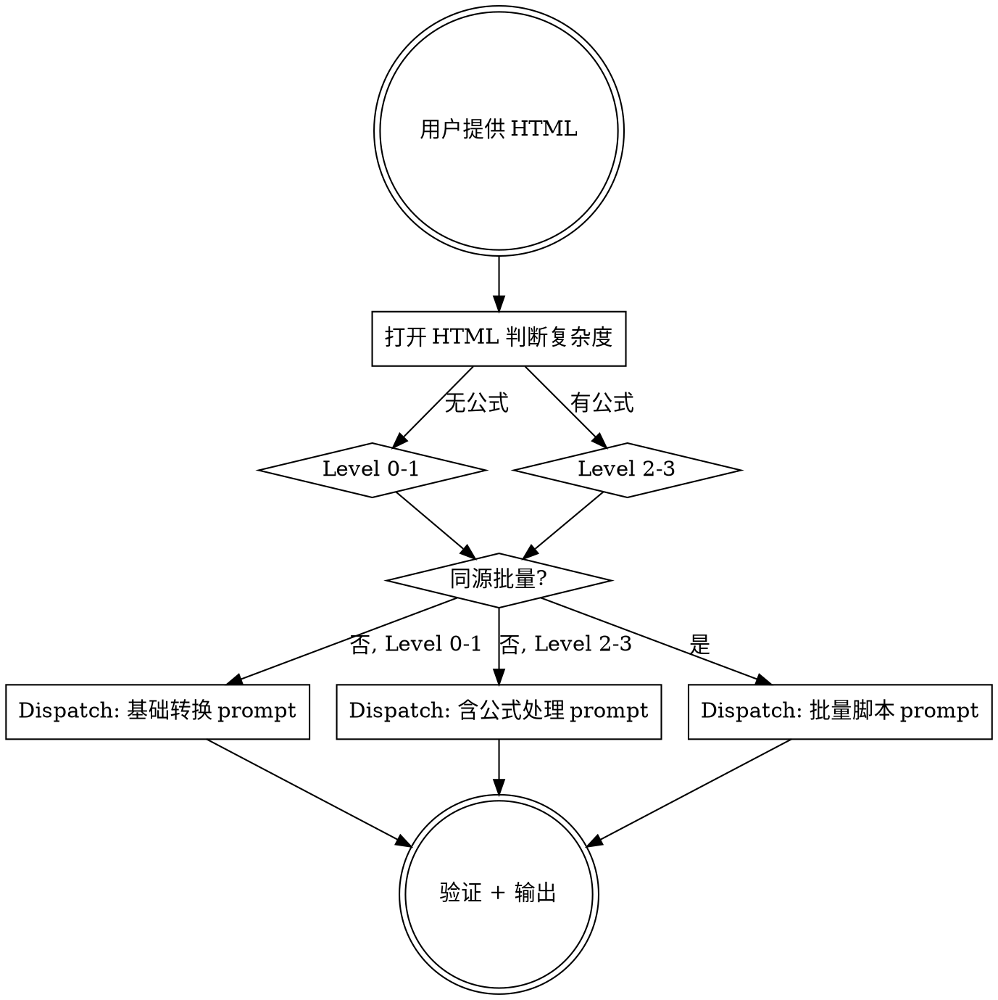

# SingleFile HTML 转离线 Markdown 包（调度模式）

将 SingleFile 保存的网页 HTML 转换为干净、结构清晰、可离线阅读的 Markdown 文档包。

**架构：** 主 agent 负责分析和质量验证，sub agent 负责实际转换工作。

## 工作流概览

```text
Phase 1: 初步分析（主 agent）
    ↓
Phase 2: Dispatch sub agent（执行转换）
    ↓
Phase 3: 质量验证（主 agent）
    ↓ 如有问题
Phase 4: 修复循环（再次 dispatch 或手动修复）
    ↓
Phase 5: 输出
```

---

## Phase 1: 初步分析（主 agent 执行）

### 1.1 打开 HTML 文件

用 Playwright 打开 SingleFile HTML，确认页面结构。

### 1.1a 探测原则：按语义容器，不按 HTML 标签

**富文本编辑器（Slate 等）用 `data-slate-type` 等自定义属性表示代码块、表格、列表，不用标准标签。** 静态 lxml 按 `<pre>/<code>/<table>` 标签计数会严重低估——实测把 3 篇各含 4-7 个代码块的文章判成"0 代码块"，表格全漏。

探测计数一律走**双轨（语义属性 OR 标准标签）**：

| 探测项 | 查询 |
|--------|------|
| 代码块 | `[data-slate-type="pre"]` OR `pre>code` |
| 表格 | `[data-slate-type="table"]` OR `<table>` |
| 列表 | `[data-slate-type="list"]` OR `<ul>/<ol>` |
| 公式 | `.katex` / `math` / `[data-slate-type*="katex"]` |

判定复杂度前，先用 Playwright 在**渲染后的 DOM**（非仅静态解析）确认，或对 `data-slate-type` 做一次全量 distinct 值枚举，避免漏掉编辑器特有容器。

### 1.2 复杂度分级

| 级别 | 条件 | 公式处理 | 验证深度 |
|------|------|---------|---------|
| Level 0 | 无公式、无正文图片、无代码块、无评论 | 跳过 | 整页对比即可 |
| Level 1 | 无公式（N_formula = 0） | 跳过 | 整页 + 列表/评论局部 |
| Level 2 | 有公式，有原始 LaTeX | 提取 + 渲染验证 | 整页 + 公式区域局部 |
| Level 3 | 有公式，无原始 LaTeX，需重建 | 完整公式处理 | 整页 + 逐公式局部 |

### 1.3 页面类型分流（与复杂度并列）

除复杂度外，先识别页面类型——不同类型的提取协议差异很大：

| 类型 | 信号 | 适用文档 |
|------|------|---------|
| 文章/博客 | `<article>` / `<main>` / 富文本编辑器（Slate 等） | conversion-rules.md |
| Notebook 类（Jupyter/Databricks/Colab） | `data-mode-id` / `command-input` / `cm-editor` / `jp-Cell` / 标题含 `notebook` | **notebook-and-virtualized.md** |
| 含虚拟化容器 | Monaco editor / CodeMirror / react-virtualized；活跃元素数 < 实际数 | **notebook-and-virtualized.md** |
| 含 lazy-load 空占位 | `<iframe src="">` / `.zip
└── 文章标题目录/
    ├── 文章标题.md
    └── files/<zip-英文名>/ (图片)

**打包注意：**
- 机器常无 `zip` 命令，用 Python `zipfile`。
- **`zipfile` 打包命令里不要串 `pkill` 等可能非零退出的收尾操作**：若写成 `zip打包 && pkill ...` 或同一 heredoc，`pkill` 的退出码（如无匹配进程返回 1、被信号中断返回 144）会中断/掩盖整条命令，导致 zip 实际没打成却以为成功。打包单独一条命令跑；清理（停 server 等）另起一条。
- **改完 md 必须重打 zip 再交付**，且重打后 `zipfile` 读取校验一次内容（grep 关键改动），别只看时间戳。

## 转换规则

### DOM 审计（提取前必须执行）
[从 conversion-rules.md 精简关键规则]
- 建立计数基线：公式、列表项、图片、代码块、标题、评论
- 容器嵌套穿透：无标记中间层必须递归搜索
- 列表项计数是强制的

### 列表处理
- 有序证据：<ol> / data-list-type="ordered" / CSS counter / content:attr(...)
- 判定证据可能在列表项子树中而非列表项自身，搜索时须遍历子树
- 无序证据：<ul> / CSS bullet / 无法确认→默认无序
- 禁止双 marker
- 不得根据"内容像步骤"改变 marker 类型
[如果是 Slate 编辑器，补充 Slate 列表映射]

### 评论区
- 不得默认删除
- 只匹配顶层评论容器
- 用 Playwright 确认各子区域（正文 vs 回复）的实际用途，不凭 class 名猜测
- 保留：技术问题、纠错、作者回复、长评论
- 删除：打卡、纯表情、广告、头像
- 格式：### 评论 N + blockquote 回复

### 图片
- base64 → 解码保存为 files/<zip-同名>/image_NN.ext
- 删除装饰图（<50px）
- 评论图片带 comment_ 前缀
- **默认去站点水印（高风险，护栏必守）**：部分站点在正文图角落（多右下）嵌站点 logo+文字水印。默认去除，只在用户要求保留时跳过。**必须在原图上、压缩之前做**（压缩 artifact/缩放会干扰检测和 bbox）。三条已踩坑护栏——① 特征色会命中正文同色，只取**最右下连通块**当 logo，别框全图同色像素；② bbox **紧框水印本身**（logo 左缘到文字右缘、只含水印高度），**禁止从 logo 左上一盖到图右下角**（会擦掉正文/边框）；③ 检测和验证都在**原图**上做，不用缩略图（缩放错位会漏检）。纯色底用背景色矩形盖、压内容用 `cv2.inpaint`。逐图检测，无水印跳过。详见 conversion-rules.md 去站点水印段
- **默认压缩（接受轻微有损）**：正文图统一转 webp quality 80，宽 >1600px 等比缩到 1600（密集图表放宽到 2000）。同步改 md 引用扩展名。只在用户明确要求最高保真/不压缩时跳过。工具优先 `ffmpeg -c:v libwebp -quality 80`（转前探测 which ffmpeg/cwebp + PIL）。转后抽检一张确认无可见 artifact。**去水印在前、压缩在后**。详见 conversion-rules.md 图片压缩段

### 块级居中
- 居中证据 → Markdown 也必须居中（<div align="center">）

### 代码块
- 无 language class 时启发式检测语言（≥2 信号）

### 文本清理
- PUA 字符删除
- 零宽字符删除
- 代码 cell/代码块内部的 NBSP（U+00A0）替换为普通空格（Monaco/CodeMirror 提取常见陷阱）

### 解析器
- 必须使用 lxml，不得使用 html.parser

### Notebook/虚拟化容器（如适用）
[当 Phase 1 检测到 notebook 类或虚拟化容器时拼接此段，详见 @notebook-and-virtualized.md]
- 代码提取双源协议：备份选择器 优先 → 渲染态片段 fallback
- Output 默认保留有内容输出，跳过空容器
- 空 IFrame/img 必须从源代码或 data-src 反推 URL 回填
- 输出格式统一：代码块后空一行 + `> **Output:** ...`
- 报告必须含：保留 N / 跳过 M / 回填 K / 失败 cell idx

## 公式处理（Level 2-3 时包含）
[按复杂度级别从 formula-extraction skill 精简]

### 提取优先级
1. annotation[encoding="application/x-tex"]
2. data-tex / data-latex / data-math / alttext
3. <script type="math/tex">
4. 页面 JSON / hydration 数据
5. MathML 结构
6. KaTeX HTML 系统性重建（编写解析器）
7. 无法提取 → 截图保存

### 后处理管道（必须统一应用）
- Prime: ^' → '
- 命令粘连: \gammaV → \gamma V（join 阶段统一）
- \sim 后粘连: \simp → \sim p
- Unicode 希腊字母 → LaTeX 命令
- PUA/零宽字符删除
- 空 block-katex 防护（空 $$ 删除）

### 上下标方向
- 忠实原文，不得根据领域惯例改变
- Double subscript 只能补分组，不能改方向

## 验证要求

### 强制计数对比
提取完成后，将 DOM 基线与 Markdown 逐项对比，差异>0 的阻断项必须修复。

**所有 grep 验证脚本必须先剥离 fenced code block**（`re.sub(r'```.*?\n.*?```', '', text, flags=re.DOTALL)`），否则代码注释 `# foo` 会被当成 H1 标题命中。

### Markdown 边界检查（所有 level 强制，含无公式文档）
纯文本 grep 检查，与公式/渲染无关，**Level 0/1 也必须跑**（别因为无公式就跳过整个验证）：
- **强调定界符边界**：正则 `(\*\*[^*\n]+?\*\*)(\S)` 命中 > 0 → 阻断。闭合 `**` 右侧紧贴非空白（中文/英文/标点都触发）时 GitHub 加粗失效、星号字面显示。修：闭合前是标点→移标点出加粗（`**入口核对：**按` → `**入口核对**：按`）；否则闭合后插空格。同理查 `*`/`_`、`****` 四连星。
- **GitHub `$` 边界**（有行内公式时）：`$` 紧贴 CJK/全角标点 → 插 ASCII 空格。
- **裸字符**：PUA / 零宽 / 代码块内 NBSP。
详见 checklist.md Step 1.7。

### Playwright 渲染验证（Level 1+）
1. 创建 render.html（KaTeX + marked.js，保护数学公式后再解析）
2. .katex-error 数量 = 0
3. mstyle[mathcolor="#cc0000"] 数量 = 0
4. 渲染后 .katex 数量 ≈ DOM 基线
5. 整页截图对比 + 高风险区域局部截图

### 修复循环
发现问题 → 局部修复 → 重新验证 → 循环直到通过

## 输出
返回 zip 文件路径 + 简短处理报告。
```

### 同源批量的 prompt 变体

增加以下段落：

```
## 批量处理策略
共 [N] 个文件来自同一站点，DOM 结构一致。
1. 先分析第一篇确定选择器和结构
2. 编写 Python 脚本（BeautifulSoup + lxml）统一处理
3. 内置审计计数
4. 所有文章输出到一个 zip，每篇一个子目录
```

### 主/子 agent 验证分工契约

**问题**：sub agent 自报"error=0"不可全信——实测出现 sub agent 报 `.katex-error=0`，主 agent 独立复验测出 error=1 的情况（sub agent 渲染方式与主 agent 不同）。

**契约**：

| 验证项 | sub agent 自验证 | 主 agent 独立复验 |
|--------|:---:|:---:|
| 计数对比（DOM 基线 vs md） | ✓ 必跑 | ✓ 采信前抽验 |
| KaTeX `.katex-error` = 0 | ✓ 必跑 | ✓ **必须独立复验，不采信 sub 结论** |
| GitHub 边界（`$` 紧贴 CJK） | ✓ 必跑 | ✓ **必须独立复验** |
| 强调 `**`/`*`/`_` 边界（所有 level，含无公式） | ✓ 必跑 | ✓ **必须独立复验** |
| 裸 CJK / PUA / 零宽 / NBSP | ✓ 必跑 | ✓ **必须独立复验** |
| 截图语义对比 | 高风险区 | 高风险区抽检 |

**统一模板**：sub agent 与主 agent 的 KaTeX 渲染验证**共用同一 render.html 模板**（KaTeX CDN + marked.js + 公式保护），避免"两套渲染路径结论不一致"。主 agent 复验时直接打开 sub agent 产出的 render.html，或用同一模板重建。

---

## Phase 3: 质量验证（主 agent 执行）

Sub agent 返回结果后，主 agent 执行最终质量验证。参考 @checklist.md。

### 必须验证的项目

1. **计数对比**：确认 sub agent 报告的 DOM 基线 vs Markdown 实际数量无阻断差异
2. **Playwright 渲染**：打开 sub agent 创建的 render.html，独立验证 KaTeX error = 0
3. **截图抽检**：对高风险区域（公式密集段、列表、评论区）做局部截图对比
4. **zip 完整性**：确认 zip 解压后图片路径正确、文件存在

### 最终输出报告

参考 @checklist.md 中的报告模板，向用户提供：
- 复杂度级别
- 各项计数对比结果
- 是否有人工复核标注
- zip 下载路径

---

## Phase 4: 修复循环

如果 Phase 3 发现问题：

- **小问题**（个别公式错误、单个列表 marker 错误）：主 agent 直接修复
- **系统性问题**（大量公式失败、列表结构全部错误）：再次 dispatch sub agent，prompt 中包含具体问题描述和修复指导

---

## Phase 5: 输出

提供 `.zip` 下载链接 + 最终报告。

---

## 关键决策点



## 参考文档

- @conversion-rules.md — 完整转换规则（列表、评论、图片、居中、代码块等）
- @notebook-and-virtualized.md — Notebook 类页面（Jupyter/Databricks/Colab）+ Monaco/CodeMirror 等虚拟化容器 + lazy-load 空占位回填
- @blocking-rules.md — 阻断规则（验证阶段使用）
- @checklist.md — 验证 checklist 和报告模板
- `formula-extraction` skill — 公式提取的权威参考（独立 skill）
